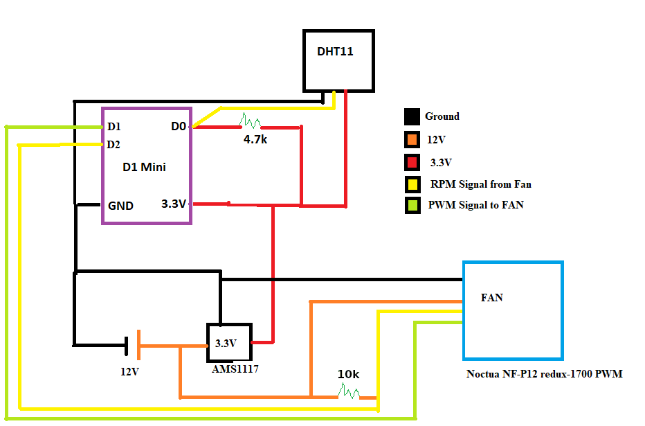

# ESPHome Fun Projects

### Projects:
[Rack Fan](#rack_fan) - PWM Fan Controller to keep you equipment Controller


### Rack Fan
##### Concept:<br>
I have a [Nav Point 22U](https://navepoint.com/navepoint-22u-600mm-depth-networking-cabinet-performance-series/) rack in my basement for all my network equipment. The rack includes two top mount AC fans. They are fixed speed and loud when you're in the same room. I wanted to replace the fans with DC [PWM](https://en.wikipedia.org/wiki/Pulse-width_modulation_) fans that could be controlled from Home Assistant.

##### Goals:<br>
1. Create a fan controller with automatic speed control based on temperature input<br>
2. Ability to override temp input and manually set a fan speed<br>
3. Display and control data from controller in Home Assistant

##### Equipment:<br>
[WEMOS D1 Mini V3](https://www.wemos.cc/en/latest/d1/index.html) - ESP8266 for ESPHome<br>
[2x Noctua NF-P12](https://www.amazon.com/gp/product/B07CG2PGY6) - 4 Pin PWM Fan<br>
[4 Pin Fan Splitter](https://www.amazon.com/gp/product/B00KG8K5CY)<br>
[AMS1117 Buck Step Down to 3.3V](https://www.amazon.com/gp/product/B07CP4P5XJ)<br>
[12V DC Power Supply](https://www.amazon.com/gp/product/B088WMSMD9)<br>
[Case]()

##### Wiring:<br>


##### Screenshot:<br>
######   Speed set by temperature sensor
<br><br>
<br><br>
######   Fan Speed Override Set
<br><br>
<br><br>
######   Other Data and Controls
<br><br>
<br><br>

### The Code!
[rack-fan.yaml](./rack-fan.yaml)

### Secrets
In your secrets.yaml define:
```
wifi_ssid: "WIFI_NAME"
wifi_password: "WIFI_PASSWORD"
ota_password: "OTA_PASSWORD"
```

### Data and Testing
Input Speed	Freq at o-scope (Hz)	Reported Speed (RPM)	Counter from ESP LOGS Pulse/min	Count/2			Calculated Speed (1700*input speed)
33.00%	23	694	1388	694			690
66.00%	41	1233	2466	1233			1,230
100.00%	56.5	1700	3400	1700			1,695
